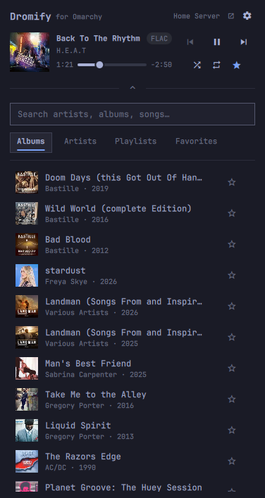
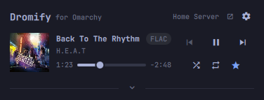
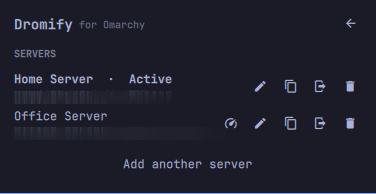

# Dromify for Omarchy

An [Omarchy](https://omarchy.org) shell plugin that brings a
[Navidrome](https://www.navidrome.org) / Subsonic-API music library into the
bar: search, browse, and play, with transport controls, cover art, and
favourites. Free and open source; no account or subscription beyond your own
server.

It shares a name with [Dromify](https://dromify.app), my Subsonic client for
iPhone, Apple Watch, and Apple TV, but nothing else — it follows your
Omarchy theme, not the app's.



## Features

- Any Subsonic-API server (Navidrome, Airsonic, Gonic, Ampache in Subsonic
  mode, ...)
- **Multiple servers** — save several by name, switch between them, rename,
  sign out, or remove
- Search artists, albums, and songs
- Browse newest albums, artists → albums → tracks, playlists, and starred
  favourites
- Play/pause, next/previous, seek, shuffle, repeat; the queue is whatever
  list you played from
- The playing track is marked in the list it came from
- Now Playing shows elapsed/remaining time and a pill for what's actually
  streaming — `FLAC`, `MP3 320`, and so on
- Star/unstar from the list or the Now Playing bar
- Cover art, cached locally
- Collapse the browsing view to just Now Playing while something's playing

  
- Streams through `mpv`, so it's a normal MPRIS player: media keys,
  `playerctl`, and Omarchy's Media widget all control it
- One session shared across every monitor — same queue and now-playing
  wherever you open the bar
- Keyboard-driven: `j`/`k` to move, `Enter` to activate, `/` to search, `f`
  to favourite, `r` to refresh, `Esc` to go back
- Passwords live in the desktop keyring (`secret-tool` / libsecret), not in
  a config file
- The server name in the header links to its web UI; each settings row has
  a copy-password button for the first sign-in there

### Multiple servers



The gear in the header opens settings. Each server has switch, rename,
sign-out, and remove; a form at the bottom adds another.

## Requirements

All in Arch's official repos, most already on a stock Omarchy install:

- `mpv` and [`mpv-mpris`](https://github.com/hoyon/mpv-mpris) (`omarchy pkg add mpv mpv-mpris`)
- `curl`, `jq`, `socat`
- `wl-clipboard` — ships with Omarchy; used by the copy-password button
- `secret-tool` (`libsecret`) and a running Secret Service — GNOME Keyring
  or KWallet

## Install

```
omarchy plugin add https://github.com/tallahootie/dromify-omarchy.git --enable
```

Pick a bar section when prompted (default: right). Move it later with
`omarchy bar move tallahootie.dromify --section <left|center|right>`.

By hand:

```
git clone https://github.com/tallahootie/dromify-omarchy.git \
  ~/.config/omarchy/plugins/tallahootie.dromify
omarchy plugin enable tallahootie.dromify
```

## Use

Click the music-note pill in the bar. It asks for a server name and the
URL/username/password, then remembers you — server details in
`~/.config/omarchy/dromify/config.json`, password in the keyring. Add or
switch servers from the gear icon.

**Bar pill** — left click opens the panel, right click play/pause, middle
click next.

**Panel** — click an artist/album/playlist to open it, a song to play it.
`j`/`k`/`h`/`l` or arrows to move, `Enter`/`Space` to activate, `Esc` to go
back. `/` searches, `f` favourites, `r` refreshes. Hardware media keys and
`playerctl` work too.

## Remove

```
omarchy plugin remove tallahootie.dromify
```

To also clear saved servers and cache:

```
rm -rf ~/.config/omarchy/dromify ~/.cache/dromify ~/.local/state/dromify
secret-tool clear service omarchy-dromify
```

## How it's built

Plain Quickshell QML (`Panel.qml`, `Service.qml`) over two small bash
scripts:

- `bin/dromify-api` — Subsonic REST client: server profiles, browsing,
  search, favourites, cover art, stream URLs.
- `bin/dromify-player` — drives one persistent `mpv` instance over its JSON
  IPC socket. mpv's playlist is the queue, so next/previous work through
  MPRIS and hardware media keys.

Both run standalone:

```
echo demo | bin/dromify-api configure Demo https://demo.navidrome.org demo
bin/dromify-api get getRandomSongs.view size=5
bin/dromify-player status
```

## Licence

MIT — see [LICENSE](LICENSE).
